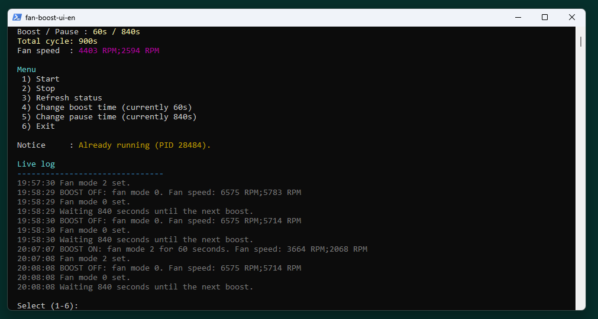

# msi-fan-boost-controller

PowerShell terminal UI for running MSI Cooler Boost / fan boost in a timed cycle.



## Status

This is an experimental MSI laptop fan-control helper. It was built and tested on one machine only:

- **Tested model:** MSI GE76 Raider
- **Operating system:** Windows
- **MSI software:** MSI Center must be installed

There is no guarantee that it works on other MSI laptops, BIOS versions, MSI Center versions, or Windows installations.

## Safety warning

Use this tool entirely at your own risk.

This project calls MSI Center's internal .NET APIs to switch fan modes. Those APIs are not documented for public use and may behave differently across devices. No warranty is provided. The author and contributors assume no liability for hardware behavior, fan behavior, thermal behavior, data loss, system instability, or any other damage.

## What it does

- Starts a repeating fan boost cycle.
- Default cycle: **60 seconds boost**, then **840 seconds pause**.
- Shows status, process ID, boost/pause duration, cycle length, fan speed, and a live log.
- Lets you change boost and pause duration from the terminal UI.
- Stops the worker when you choose `Exit`.
- The hidden worker also exits when the UI process disappears.

## Requirements

- Windows
- Windows PowerShell 5.1
- MSI Center installed at:
  - `C:\Program Files (x86)\MSI\MSI Center`
- Administrator permission when the worker starts

## Quick start

Download or clone the repository, then double-click:

```text
start-msi-fan-boost-controller.cmd
```

Alternative launcher:

```text
scripts\fan-boost-ui-en.cmd
```

From a terminal:

```powershell
powershell -NoProfile -ExecutionPolicy Bypass -File scripts\fan-boost-ui.ps1
```

## UI controls

- `1` Start
- `2` Stop
- `3` Refresh status
- `4` Change boost time
- `5` Change pause time
- `6` Exit

The main menu reads single number keys. Pressing Enter is not required.

## Runtime files

The scripts create local runtime files inside `scripts/`:

- `fan-boost-ui.config.json`
- `msi-fanboost-cycle.log`
- `msi-fanboost-cycle.state`

These files are ignored by Git.

## Troubleshooting

If the tool does not start:

- Make sure MSI Center is installed.
- Make sure the MSI Center path matches `C:\Program Files (x86)\MSI\MSI Center`.
- Start the UI through `start-msi-fan-boost-controller.cmd`.
- Accept the Windows UAC prompt when the worker starts.

If fan speed shows `n/a`:

- The worker may not be running.
- MSI Center's internal API may not return fan speed on your machine.
- Check `scripts\msi-fanboost-cycle.log`.

If fan boost starts but does not stop:

- Open the UI and press `2` Stop.
- Close the UI and wait a few seconds.
- If needed, stop the worker PowerShell process manually from Task Manager.

## Repository contents

- `start-msi-fan-boost-controller.cmd` - top-level ZIP/download launcher
- `scripts/fan-boost-ui.ps1` - terminal UI
- `scripts/fan-boost-ui-en.cmd` - English launcher
- `scripts/fan-boost-ui.cmd` - equivalent launcher kept for compatibility
- `scripts/msi-fanboost-cycle.ps1` - elevated worker process
- `assets/screenshots/` - README screenshot

## License

MIT License. See [LICENSE](LICENSE).
